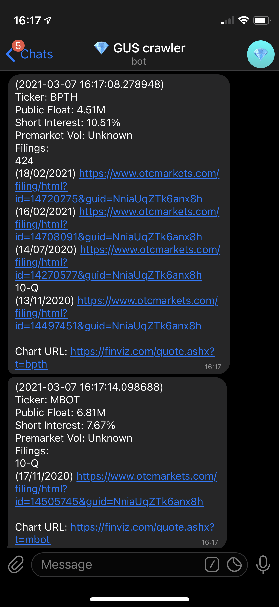

 # Ticker Info Scraper 
Got sick of manually visiting several sites to get the ticker information. This is a free non-API web scraper that scrapes various sites for relevant information regarding ticker(s). Pulls information from various sources including FINVIZ (chart, public float, short interest), MarketWatch (premarket volume), and  otcmarkets.com (SEC filings). 

Uses the following py packages:

Uses  | Version | Info
------------- | - | -------------
beautifulsoup4 | 4.9.3 | HTML parser
requests | 2.25.1 | GET reqs to Telegram API
user-agent | 0.1.9 | to generate HTTP user-agent header

Also uses Telegram Bot API.

## General Flow

1. Sends a comma-separated list of tickers to the Telegram bot.

<br/>

2. The bot replies with the information of each ticker.

<br/>

### Prerequisites (Raspbian/macOS/Ubuntu)

The entire setup requires setting up a Telegram Bot (easy step-by-step guide [here](https://medium.com/@wk0/send-and-receive-messages-with-the-telegram-api-17de9102ab78)), as well as an Internet-connected machine hosting this script.

Install python3 and pip3, in the system hosting the script (I used a Raspberry Pi Zero):

```
sudo apt-get install python3
sudo apt-get install python3-pip
```

### Installing

Clone to your local directory:

```
git clone https://github.com/ohsyln/ticker-info-scraper
cd ticker-info-scraper
```

Create virtual environment, and activate:

```
python3 -m venv pyenv
. pyenv/bin/activate
```

Install the required packages using pip3 into your virtual environment:
```
pip3 install requests beautifulsoup4 user-agent
```

## Run script

Edit `API_KEY` in `ticker-info-scraper.py` with a text editor:

```
API_KEY = "<YOUR TELEGRAM BOT API KEY HERE>"
```

Run script on your Internet-connected machine to listen to user input via Telegram bot.

```
python3 ticker-info-scraper.py
```

## License

MIT
